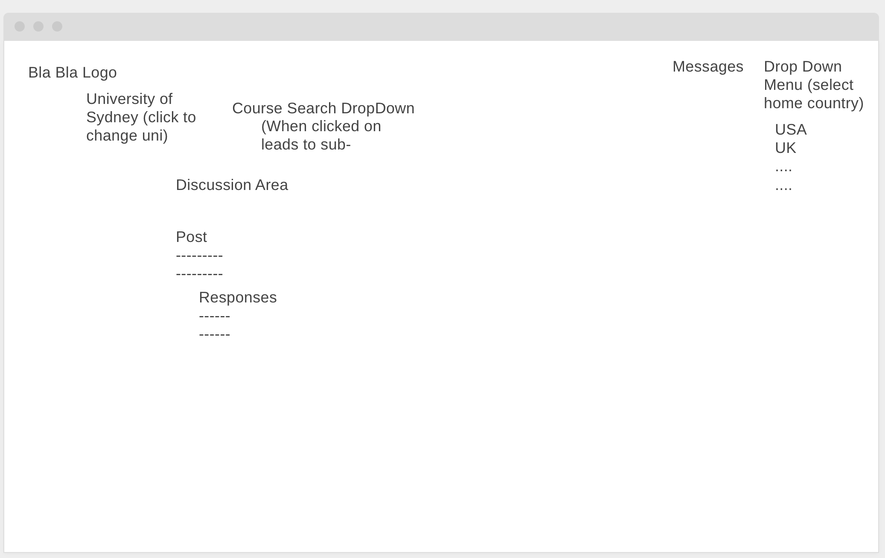

# Note
After exploring a few different ideas, my group decided to move forward with a community hub for exchange students at the University of Sydney. The goal is to create a space where students coming from universities in other countries can connect, ask questions, and share advice. Compared to my earlier ideas, this felt more grounded in a clear and immediate need.
Exchange students often arrive with similar questions about courses, housing, transport, and social life. While this information exists, it is usually spread across official university pages, group chats, and different social media platforms. This can make it harder to find reliable answers. A central discussion space could make these conversations easier to access and more useful over time.

Our wireframe helped us start thinking about how this would actually work in practice. At the centre of the design is a discussion area where users can create posts and respond to each other. This feels like the most important functional requirement because the entire platform depends on users being able to share information and interact. Without this, there is no real community.
One decision we made was to include both a general discussion page and more specific filtering options. In the wireframe, this appears as a course search dropdown. The reasoning behind this is that some questions apply to all exchange students, while others are more specific. For example, a question about orientation week would belong in the general space, while a question about course difficulty or requirements might make more sense in a course-specific discussion.
We also included the option to filter by home country. This came from thinking about how students from different countries may have different concerns. For example, students from the United States may have different credit transfer issues or expectations compared to students from the United Kingdom. Allowing users to filter based on their home country could make the information more relevant and easier to navigate.
Another feature shown in the wireframe is individual messaging. At first, this seemed like a strong addition because it allows for more personal interaction. Students might want to ask private questions about housing or settling in. However, I am starting to see trade-offs with this feature. Messaging increases complexity and raises questions about privacy and moderation. It may not be necessary for an initial version of the prototype.
Looking at this layout made me realise that managing scope will be important. It is easy to keep adding features, but not all of them are equally important. Right now, the discussion area and filtering options feel like the core of the app. Other features, like messaging, may be better treated as secondary or added later if time allows.
